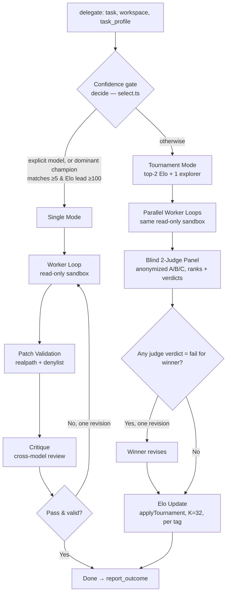

# Elodrome

An MCP server + CLI that lets Claude Code delegate coding tasks to NVIDIA NIM models (free endpoints) through a server-side pipeline — agentic read-only workers propose changes, a different model reviews them, and by default delegations run as blind tournaments where 2–3 models compete, a two-judge panel ranks anonymized entries, and per-tag Elo ratings accumulate into a per-repo leaderboard that routing learns from.

## Why

NVIDIA hosts NIM inference endpoints at no cost, so the marginal model call is free.
Once extra calls are free, competition and cross-review stop being luxuries and
become rational defaults: it costs nothing to run two or three workers in parallel
on the same task and have a different model rank them blind. The orchestrator LLM
(Claude Code) stays the strategist and the only write path — it decides what to
delegate, reviews proposed changes, applies the ones it accepts, and reports the
outcome back so routing improves with use. The by-product of all those free calls
is a per-repo, per-capability Elo leaderboard that no public benchmark can match,
measured on *your* codebase.

## How it works

`delegate` takes a task, a workspace, and a `task_profile` of capability tags. If an
explicit `model` is passed it bypasses routing (single mode); otherwise a confidence
gate decides single vs tournament. The full path lives in `src/pipeline/delegate.ts`.



Single mode returns proposed changes plus a critique (one revision if the critique
fails). Tournament mode runs contestants concurrently, scores anonymized entries with
a two-judge panel, gives the winner one revision round iff any judge flagged it `fail`,
then applies pairwise Elo deltas per profile tag. Forfeits are classified: infra errors
(429/5xx/404) are no-contests that record an availability strike with no Elo effect,
while task failures count as last-place losses.

## Quickstart

```bash
pnpm install
export NVIDIA_API_KEY=...   # from build.nvidia.com (no charge); elodrome fails fast if unset
```

Register the server with Claude Code by adding it to your project's `.mcp.json`:

```json
{
  "mcpServers": {
    "elodrome": {
      "command": "sh",
      "args": [
        "-c",
        "cd /path/to/this/repo && set -a && { [ -f .env ] && . ./.env; }; set +a; exec pnpm mcp"
      ]
    }
  }
}
```

### MCP tools

- `delegate` — Delegate a coding/research task through the full pipeline (worker loop →
  validation → critique/judging). Takes `task`, `workspace` (absolute path),
  `task_profile` (capability tags), optional `model` to force a specific worker.
  Returns proposed changes for **you** to review and apply — the worker never writes.
- `consult` — Single-shot second opinion from a specific NIM model. No tools, no
  pipeline — prompt and reply. Good for design questions and tie-breaking.
- `list_models` — Registry models with capability tags, tool-calling reliability,
  eval scores, and outcome win rates. Use it to pick a model.
- `leaderboard` — Per-repo Elo ratings and match counts per capability tag, built from
  tournament results and outcome reports. Optional `tag` filter.
- `report_outcome` — **Required** after every `delegate`, once you've reviewed the
  result: record `accepted` | `reworked` | `rejected`. Feeds win rates used for future
  routing (Elo nudge +8 / −4 / −16).

### CLI (`elodrome`)

```bash
pnpm elodrome models                                                                 # list registry models + win rates
pnpm elodrome run --task "..." --workspace $PWD --profile code-gen,fast [--model id] # delegate via full pipeline
pnpm elodrome eval --suite evals/coding-basic.yaml --workspace $PWD --model id       # run an eval suite against a model
pnpm elodrome leaderboard [--tag code-gen] [--md]                                    # per-tag Elo rankings
```

Outputs >20KB from a tool are written to `<runsDir>/payloads/<runId>.json` and returned
by path (`~/.elodrome/runs` by default). State lives at `~/.elodrome/state.json`
(lockfile-guarded); override either with `ELODROME_RUNS_DIR` / `ELODROME_STATE`.

## The Arena

Tournament is the default delegation path; the confidence gate (`decide` in
`src/arena/select.ts`) routes single-mode only when a dominant champion exists for the
primary tag (≥5 matches and ≥100 Elo lead over the runner-up), earning back
single-model speed with no contest overhead. Otherwise the arena selects the top-2
primary-tag Elo models plus one least-tested explorer (3 contestants, scaled to 2 if the
catalog is thin) and runs their worker loops in parallel against one shared read-only
sandbox. Entries are anonymized via a stable shuffle to labels A/B/C with model names
scrubbed from entry text, then a two-judge panel of `review`-tag models (excluded from
the contest) ranks and verdicts them blind; a rank-sum aggregate decides the winner, with
the higher-Elo judge breaking ties. Forfeits are classified by cause: infra failures
(NIM 429/5xx/404) are no-contests excluded from judging and Elo but logged as an
availability strike, while task failures (malformed submits, blown budget/timeout) count
as last-place losses in every pairwise Elo result. Each tournament updates Elo per
profile tag with K=32, so the leaderboard gets measurably better the more you delegate.
Inspect it with `pnpm elodrome leaderboard --md`.

## Safety model

- **Workers are read-only and sandboxed.** Every file path is resolved through
  `realpath` and checked with `isWithin(workspace, ...)` so symlinks can't escape the
  workspace; a case-insensitive secrets denylist (`.env`, `.pem`, `id_*`, `.ssh/`,
  `.aws/`, `.netrc`, `.npmrc`, `.key`, `credentials`, `secrets`) plus `.git` and
  `.gitignore`-filtered paths are rejected.
- **The orchestrator is the only write path.** Workers propose changes (diffs / full
  files); the orchestrator LLM reviews them and applies the ones it accepts with its own
  Edit/Write tools, skipping or redoing invalid ones. Workers never write.
- **Never delegate** architecture/strategy decisions, security-sensitive changes, or
  anything touching secrets or auth — those stay with the frontier model.
- **Outcome reporting trains routing.** Calling `report_outcome` after each delegation
  nudges Elo (+8 accepted / −4 reworked / −16 rejected) on the run's tags, so
  the registry learns which models earn their routing.

## Further reading

- [Architecture](docs/ARCHITECTURE.md) — pipeline, sandbox, state store, MCP/CLI surfaces.
- [Security & Code-Quality Audit](docs/AUDIT-2026-07-03.md) — untrusted-input boundaries and findings.

## License

MIT — see [LICENSE](LICENSE).
