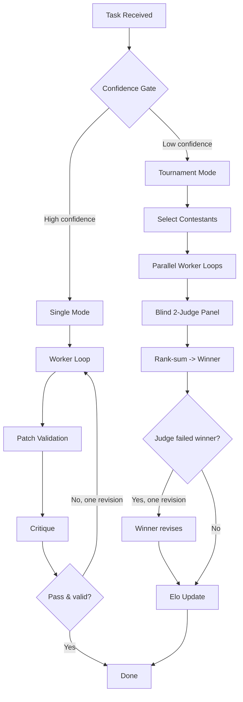

# Elodrome Architecture

## Overview
`Elodrome` is a multi-model delegation system for code generation and review tasks. It routes tasks to worker models via a confidence-gated tournament system, validates changes in a secure sandbox, and maintains a persistent state store for model performance tracking.

Core components:
- **Delegate Pipeline**: Single-mode or tournament-mode task execution with iterative refinement.
- **Sandbox**: Filesystem isolation and secrets denylist enforcement.
- **State Store**: Machine-local JSON file with advisory locking for Elo ratings and outcome statistics.
- **MCP/CLI**: Dual surfaces for programmatic and CLI interaction.

---

## Delegate Pipeline

### Flowchart


### Single Mode
1. **Worker Loop**: Agentic task execution (`runWorkerLoop` in `src/worker/loop.ts`) with read-only workspace access. Max request and timeout limits enforced.
2. **Patch Validation**: Changes validated against filesystem constraints (`validateChanges` in `src/patch/validate.ts`). Files must:
   - Resolve within the workspace via `realpath`.
   - Not match secrets/.git denylist patterns.
   - Pass `.gitignore` filtering.
3. **Critique**: Cross-model review (`runCritique` in `src/pipeline/critique.ts`) by a separate critique model.
4. **Revision**: If critique fails, the worker revises its output once.

### Tournament Mode
1. **Confidence Gate** (`decide` in `src/arena/select.ts`):
   - Routes to single mode if the top model has ≥5 matches and ≥100 Elo lead over the runner-up.
   - Otherwise, selects top-2 + least-tested model as contestants.
2. **Parallel Contestants**: All contestants run concurrently (`runArena` in `src/arena/arena.ts`).
3. **Blind Judging**: Entries anonymized, model names scrubbed, then scored by a 2-judge panel (`runJudgePanel` in `src/arena/judge.ts`). Judges see labeled entries (A/B/C) with summary, rationale, and changes.
4. **Elo Updates** (`applyTournament` in `src/arena/elo.ts`):
   - Pairwise Elo deltas calculated with K=32.
   - Winners gain Elo commensurate with the strength of defeated opponents.
   - No-contest (infra forfeit) models excluded from pairings but record an availability strike.
   - Judge agreement stats updated.
5. **Revision**: If any judge's verdict for the winner is `fail`, the winner revises once (re-validated, not re-judged).

---

## Sandbox Security
Modeled in `src/sandbox/sandbox.ts`.

### Realpath Containment
- Workspace resolution uses `realpathSync` to resolve symlinks.
- All paths checked via `isWithin(base, realpath(target))` to prevent symlink-based escapes.
- Temporary fallback to deepest existing realpath ancestor for paths not yet created.

### Secrets Denylist
- Case-insensitive regex patterns for filenames:
  ```
  \.env$, \.pem$, id_[^/]+$, \.ssh/, \.aws/, authorized_keys$, \.netrc$, \.npmrc$, \.key$, credentials, secrets
  ```
- `.git` directory and `.gitignore`-filtered paths denied.

---

## Machine-Local State Store
Modeled in `src/registry/state.ts`.

### File Layout
- Default path: `~/.elodrome/state.json`.
- Schema version 1 (Zod-enforced):
  ```ts
  {
    "models": {
      "<modelId>": {
        "ratings": Record<CapabilityTag, {elo: number, matches: number}>,
        "outcomes": {accepted: number, reworked: number, rejected: number},
        "availabilityStrikes": number
      }
    },
    "judgeAgreement": {agree: number, total: number}
  }
  ```

### Advisory Locking
- Uses exclusive `.lock` directory with PID/token-based ownership.
- Stale locks (>10s) reclaimed via random `.reclaim-<uuid>` rename.
- 200 retry attempts with 25ms backoff.

### Seeding
- Models initialized from registry catalog:
  ```ts
  DEFAULT_ELO + (8 * accepted) - (4 * reworked) - (16 * rejected)
  ```
- Catalog models absent from the state file are seeded on load; legacy v1 outcome history sets their initial Elo and match counts.

---

## MCP/CLI Surfaces

### MCP Server (`src/mcp/server.ts`)
Tools:
- `list_models`: Registry models with win rates and Elo ratings.
- `delegate`: Full pipeline execution. Inputs: task, workspace, capability tags. Returns proposed changes for manual review.
- `consult`: Single-shot chat with a model.
- `leaderboard`: Elo ratings per capability tag.
- `report_outcome`: REQUIRED post-delegate feedback (`accepted`/`reworked`/`rejected`). Updates Elo via `applyOutcome` (nudge: +8/-4/-16).

Results >20KB are written to `<runsDir>/payloads/<runId>.json` and returned by path.

### CLI (`src/cli/index.ts`)
Commands:
- `models`: List registry models with win rates.
- `run`: CLI wrapper for `delegate`.
- `eval`: Run an eval suite against a model.
- `leaderboard`: Print per-tag Elo rankings, optionally as markdown.

Environment variables:
- `ELODROME_REGISTRY`: Override registry path.
- `ELODROME_STATE`: Override state path.

---

## Data Lifecycle
1. **Task Execution**: New `runId` generated (`src/trace/trace.ts`). Traces appended as JSONL to `~/.elodrome/runs/<YYYY-MM-DD>.jsonl`.
2. **Outcome Reporting**: User feedback via `report_outcome` updates Elo and increments outcome counters.
3. **State Persistence**: Atomic write via rename-after-write (`saveState` in `src/registry/state.ts`).